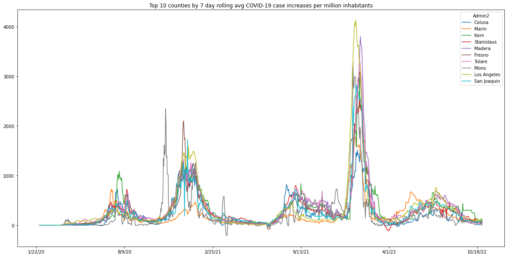
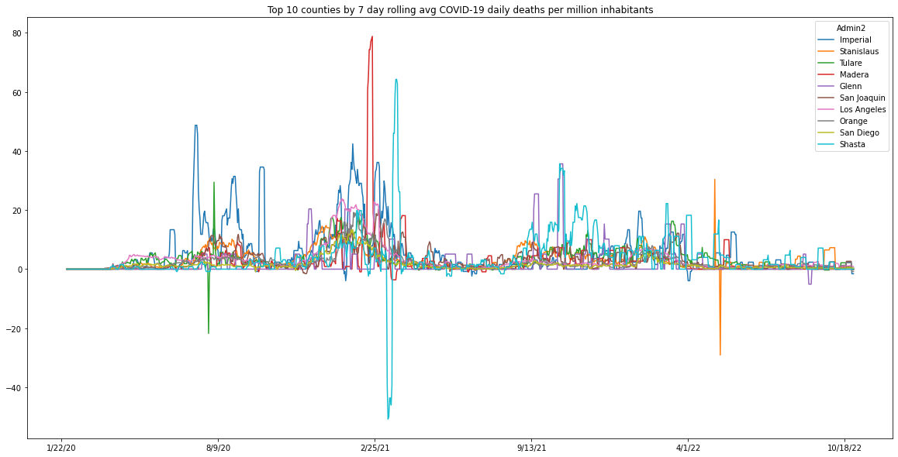

# COVID-19 US Time Series Data Analysis (California Focus)

An end-to-end data analysis and time-series evaluation project tracking COVID-19 confirmed infection trends and mortality metrics across California counties, utilizing epidemiological datasets from Johns Hopkins University.

---

## 📌 Project Overview
This repository provides an exploratory data analysis (EDA) and pipeline workflow to clean, reshape, and analyze daily time-series records of COVID-19. By pivoting wide time-series formats, computing 7-day rolling averages, and normalizing case counts against county population benchmarks, the analysis highlights infection growth curves and comparative county-level impacts.

---

## 📊 Key Insights & Visualizations

### 1. New Daily Cases (7-Day Rolling Average per Million)
Tracks the speed of transmission and wave trajectories adjusted for population density across top-impacted counties:

<p align="center">
  
</p>

---

### 2. Daily Mortality Trends (7-Day Rolling Average per Million)
Highlights disease severity and critical health impact benchmarks normalized per million inhabitants:

<p align="center">
  
</p>

---

## 📁 Repository Structure
```text
├── COVID-19_UseCase 4 (1).ipynb          # Jupyter Notebook containing end-to-end analysis
├── time_series_covid19_confirmed_US.csv   # Confirmed cases raw time-series data
├── time_series_covid19_deaths_US.csv      # Daily deaths raw time-series data
├── covid19_daily_cases.png               # Visual: Daily confirmed cases trend
├── covid19_daily_deaths.png              # Visual: Daily mortality trend
└── README.md                             # Project documentation
